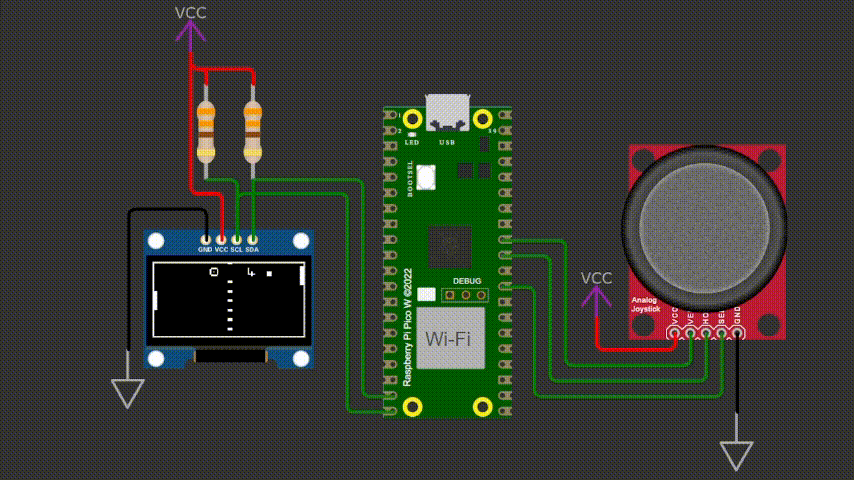

# Jogo de Ping Pong para Raspberry Pi Pico W

## Descrição
Este projeto é uma implementação do jogo de Ping Pong utilizando um **Raspberry Pi Pico W** e um **display OLED SSD1306**. O jogador controla a raquete esquerda usando um **joystick analógico**, enquanto a raquete direita é controlada por uma **IA básica**. O objetivo é rebater a bola e marcar pontos, com a dificuldade aumentando progressivamente.

<p align="center">
  
</p>

## Vídeo Demonstrativo

[Vídeo Demonstrativo](https://youtu.be/lsnwWgYrTBc)

## Recursos Principais
- Uso do **Raspberry Pi Pico W** como microcontrolador principal.
- Controle da raquete através de um **joystick analógico**.
- Exibição dos elementos do jogo no **display OLED SSD1306** via comunicação **I2C**.
- Implementação de IA básica para o adversário.
- Controle de colisões da bola com as raquetes e bordas da tela.
- Exibição de placar e interface gráfica minimalista.

## Hardware Necessário
- **Raspberry Pi Pico W**
- **Display OLED SSD1306 (I2C)**
- **Joystick analógico**
- **Resistores e jumpers para conexão**

## Conexões
### **Pinagem**

#### **Display OLED SSD1306**
| Sinal | GPIO Raspberry Pi Pico W |
|-------|--------------------------|
| SDA   | GPIO 14 |
| SCL   | GPIO 15 |
| VCC   | 3.3V |
| GND   | GND |

#### **Joystick**
| Sinal | GPIO Raspberry Pi Pico W |
|-------|--------------------------|
| VCC   | 3.3V |
| GND   | GND |
| SW    | GPIO 22 |
| VRX   | GPIO 26 |
| VRY   | GPIO 27 |

## Configuração do Ambiente
Para compilar e rodar o projeto, siga os passos abaixo:

1. Instale o **SDK do Raspberry Pi Pico**.
2. Configure o ambiente de desenvolvimento no **VS Code** ou outra IDE compatível.
3. Clone este repositório:
   ```bash
   git clone https://github.com/seu-usuario/ping-pong-pico.git
   cd ping-pong-pico
   ```
4. Compile e carregue o binário no Raspberry Pi Pico W.

## Funcionamento
- O jogo inicia com uma tela de boas-vindas e, após alguns segundos, a partida começa.
- O jogador controla a raquete da esquerda usando o joystick.
- A raquete da direita é controlada por um algoritmo simples de IA.
- A bola rebate nas bordas superiores e inferiores e pode ser rebatida pelas raquetes.
- Sempre que um jogador falha ao rebater a bola, o adversário ganha um ponto.
- O jogo reinicia com a bola no centro após cada ponto.


## 📩 Contato
Caso tenha dúvidas ou sugestões, entre em contato:
- **Desenvolvedor**: Leonardo Rodrigues
- **Linkedin**: https://www.linkedin.com/in/leonardorodrigues7/